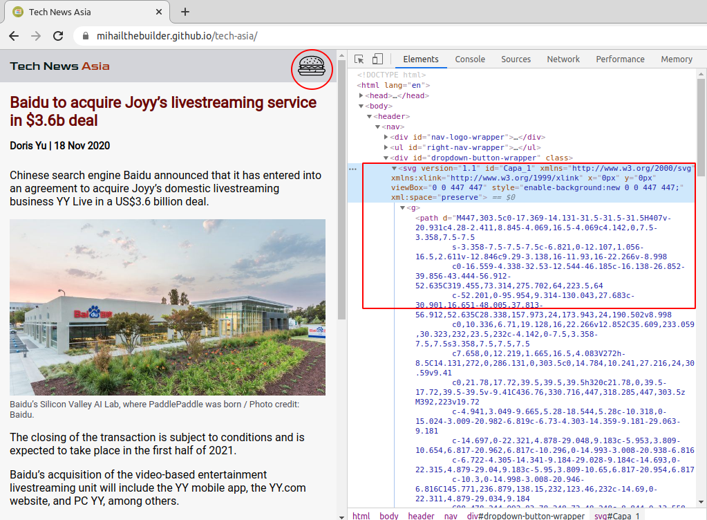

# Tech News Asia

## Overview

A 2-page, static news site on tech startups in Asia. Built with JavaScript, [Webpack 5](https://webpack.js.org/) and [Sass](https://sass-lang.com/).

## Highlights

### Webpack configuration

The following webpack plugins were installed:

#### [raw-loader](https://webpack.js.org/loaders/raw-loader/)

Imports files as a String. I use it together with [insertAdjacentHTML()](https://developer.mozilla.org/en-US/docs/Web/API/Element/insertAdjacentHTML) to render the navbar dropdown button as an `svg` HTML element:

```js
import svg from "./hamburger.svg";
let dropdownButton = document.getElementById("dropdown-button-wrapper");
dropdownButton.insertAdjacentHTML("afterbegin", svg);
```

The result:



By rendering it this way, I can select the svg element in my `scss` file and change its color through the `fill` style attribute.

Configuration in `webpack.config.js`:

```js
module: {
  rules: [
    {
      test: /\.svg$/i,
      use: "raw-loader",
    },
  ];
}
```

#### [html-loader](https://webpack.js.org/loaders/html-loader/)

Exports HTML as string. That way, I can place the HTML code in a separate file and load it into my JavaScript file as a String variable.

```js
import html from "./navbar.html";
const navbarLoad = () => {
  document.body.insertAdjacentHTML("afterbegin", html);
};
```

This feature was especially useful when rendering different articles - [see below](.......)

#### [file-loader](https://webpack.js.org/loaders/file-loader/)

### Single-page web app

No need to reload

### Mobile navbar

### Fade-out effect - no jQuery, only JavaScript
