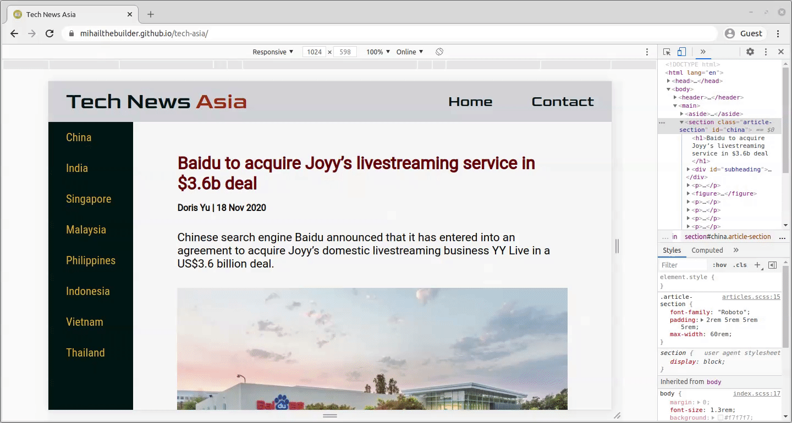

- [Tech News Asia](#tech-news-asia)
  - [Overview](#overview)
  - [Highlights](#highlights)
    - [Webpack configuration](#webpack-configuration)
      - [raw-loader](#raw-loader)
      - [html-loader](#html-loader)
      - [file-loader](#file-loader)
      - [style-loader, [css-loader](https://webpack.js.org/loaders/css-loader/), [sass-loader](https://webpack.js.org/loaders/sass-loader/) and [sass-resource-loader](https://github.com/shakacode/sass-resources-loader)](#style-loader-css-loader-sass-loader-and-sass-resource-loader)
      - [clean-webpack-plugin](#clean-webpack-plugin)
      - [webpack-dev-server](#webpack-dev-server)
    - [Single-page web app](#single-page-web-app)
    - [Desktop sidebar -> mobile navbar conversion](#desktop-sidebar---mobile-navbar-conversion)

# Tech News Asia

## Overview

A 2-page, static news site on tech startups in Asia. Built with JavaScript, [Webpack 5](https://webpack.js.org/) and [Sass](https://sass-lang.com/). See it live [here](https://mihailthebuilder.github.io/tech-asia/).

## Highlights

### Webpack configuration

The following webpack plugins were installed:

#### [raw-loader](https://webpack.js.org/loaders/raw-loader/)

Imports files as a String. I use it together with [insertAdjacentHTML()](https://developer.mozilla.org/en-US/docs/Web/API/Element/insertAdjacentHTML) to render the navbar dropdown button as an `svg` HTML element:

```js
import svg from "./hamburger.svg";
let dropdownButton = document.getElementById("dropdown-button-wrapper");
dropdownButton.insertAdjacentHTML("afterbegin", svg);
```

The result:


By rendering it this way, I can select the svg element in my `scss` file and change its color through the `fill` style attribute.

Configuration in `webpack.config.js`:

```js
module: {
  rules: [
    {
      test: /\.svg$/i,
      use: "raw-loader",
    },
  ];
}
```

#### [html-loader](https://webpack.js.org/loaders/html-loader/)

Exports HTML as string. That way, I can place the HTML code in a separate file and load it into my JavaScript file as a String variable.

```js
import html from "./navbar.html";
const navbarLoad = () => {
  document.body.insertAdjacentHTML("afterbegin", html);
};
```

This feature was especially useful when rendering different articles - [see below](#single-page-web-app)

Configuration in `webpack.config.js`:

```js
module: {
  rules: [
    {
      test: /\.html$/i,
      use: "html-loader",
    },
  ];
}
```

#### [file-loader](https://webpack.js.org/loaders/file-loader/)

Converts `import/require` statements on a file into a url and places the file in the output directory.

In this case, there is actually no `import/require` statement applied **directly** to files. Instead, the plugin is used by [html-loader](#html-loader) when reading `src` attributes in order to load article images.Example from [articles.html](./src/components/articles/articles.html):

```html
<figure>
  
  <figcaption>Photo credit: Venturebeat</figcaption>
</figure>
```

Configuration in `webpack.config.js`:

```js
module: {
  rules: [
    {
      test: /\.(png|jpg|gif|jpeg)$/,
      use: "file-loader",
    },
  ];
}
```

#### [style-loader](https://webpack.js.org/loaders/style-loader/), [css-loader](https://webpack.js.org/loaders/css-loader/), [sass-loader](https://webpack.js.org/loaders/sass-loader/) and [sass-resource-loader](https://github.com/shakacode/sass-resources-loader)

`style-loader`, `css-loader`, `sass-loader` and `sass` are used together in order to set styling with Sass.

I added `sass-resource-loader` in order to avoid having to import the [common.scss](./src/common/common.scss) file in each of the other `scss` files. This file contains a number of Sass variables.

Configuration in `webpack.config.js`:

```js
module: {
  rules: [
    {
      test: /\.scss$/,
      use: [
        "style-loader",
        "css-loader",
        "sass-loader",
        {
          loader: "sass-resources-loader",
          options: {
            resources: ["./src/common/common.scss"],
          },
        },
      ],
    },
  ];
}
```

#### [clean-webpack-plugin](https://github.com/johnagan/clean-webpack-plugin)

Removes/cleans my [build](./dist) folder. I configured it to avoid removing the `index.html` and `favicon.svg` so that I could keep the meta tags and the favicon:

```js
plugins: [
  new CleanWebpackPlugin({
    cleanOnceBeforeBuildPatterns: ["**/*", "!index.html", "!favicon.svg"],
  }),
],
```

#### [webpack-dev-server](https://github.com/webpack/webpack-dev-server)

Creates a development server with live reloading. Configuration in `webpack.config.js`:

```js
devServer: {
  contentBase: "./dist",
  hot: true,
},
```

### Single-page web app

Having everything on a single page makes loading new content very fast:


I placed the content for all articles in the [articles.html](./src/components/articles/articles.html) file for the sake of simplicity. Each article is wrapped in a `section` element with a unique `id` attribute:

```html
<section class="article-section" id="china">
  <!--code--->
</section>
<section class="article-section" id="india">
  <!--code--->
</section>
<!--code--->
```

[article.js](./src/components/articles/articles.js) then toggles between articles based on their `id`:

```js
import html from "./articles.html";

const articleLoad = (articleId = "china") => {
  //remove previous article html
  let prevSection = document.querySelector("main>section");
  if (prevSection) {
    prevSection.remove();
  }

  //get the new article from articles.html based on the id
  let doc = new DOMParser().parseFromString(html, "text/html");
  document.querySelector("main").appendChild(doc.getElementById(articleId));

  //move the viewport to the top of the page
  moveTop();
};
```

### Desktop sidebar -> mobile navbar conversion

On desktop mode, there is a sidebar that enables you to switch between articles. In tablet and mobile, this sidebar moves to the top, after the nav links, and only shown when the dropdown button is clicked:



All screen modes use the same HTML code for the sidebar, and the same JavaScript code to toggle between articles. The only difference lies in the `sidebarMobileShow` function, which is only used in tablet and mobile modes to show and hide the sidebar:

```js
const sidebarMobileShow = () => {
  //get sidebar
  let sidebar = document.getElementsByTagName("aside")[0];

  //check if navbar button is toggled to show sidebar
  if (
    document
      .getElementById("dropdown-button-wrapper")
      .classList.contains("nav-selected")
  ) {
    //show sidebar
    sidebar.style.display = "block";
  } else {
    //hide sidebar
    sidebar.style.display = "none";
  }
};
```
